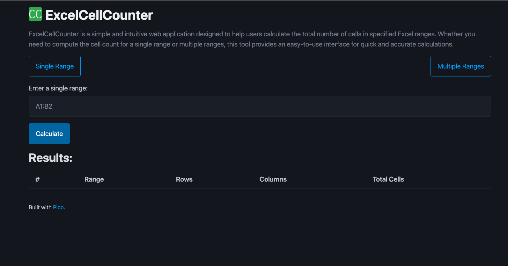
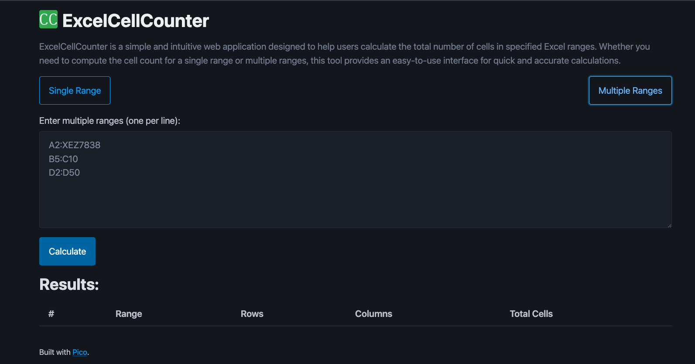

# ExcelCellCounter

**ExcelCellCounter** is a web application that allows users to compute the total number of cells for given ranges in an Excel-like format. It supports both single and multiple range inputs, making it a versatile tool for anyone working with spreadsheet data.

## Features

- **Single Range Calculation**: Input a single range (e.g., `A1:B2`) and get the total number of cells, rows, and columns.
- **Multiple Range Calculation**: Input multiple ranges, each on a new line, and get the total number of cells, rows, and columns for each range.
- **Export Results**: Easily export the calculated results to an Excel file for further analysis or reporting.

## Why Do We Need ExcelCellCounter?

ExcelCellCounter is essential for users who need to quickly determine the number of cells in specified ranges without the need for a full-fledged spreadsheet application. This is particularly useful in environments where access to spreadsheet software is limited, such as on jump boxes or remote servers.

### Use Cases

1. **Jump Boxes**: Often, jump boxes (bastion hosts) are used for secure access to networks and may not have all applications installed. ExcelCellCounter allows users to perform necessary cell calculations without needing a local spreadsheet application.
2. **Quick Calculations**: For users who need to perform quick calculations of cell counts for reporting, data analysis, or scripting purposes.
3. **Educational Use**: Educators and students can use ExcelCellCounter to learn and teach about cell ranges in spreadsheets.

## How to Use

1. **Single Range Calculation**:
   - Navigate to the Single Range view.
   - Enter a range in the format `A1:B2`.
   - Click the "Calculate" button to see the number of rows, columns, and total cells.

2. **Multiple Range Calculation**:
   - Navigate to the Multiple Ranges view.
   - Enter multiple ranges, one per line, in the format `A1:B2`.
   - Click the "Calculate" button to see the number of rows, columns, and total cells for each range.

3. **Exporting Results**:
   - After performing calculations, click the "Export to Excel" button to download the results in an Excel file.

## Technology Stack

- **Frontend**: Blazor for a rich interactive user interface.
- **Backend**: ASP.NET Core to handle calculations and export functionalities.
- **JavaScript**: For client-side validation and exporting results to Excel.

## Screenshots

*screenshots of the application here*

### Single Range View



### Multiple Ranges View



### Results View


## GIFs

*GIFs of the application in action here*


## Getting Started

### Prerequisites

- [.NET 8 SDK](https://dotnet.microsoft.com/download/dotnet/8.0)
- A modern web browser

### Installation

1. **Clone the repository**:
   ```sh
   git clone https://github.com/yourusername/ExcelCellCounter.git
   cd ExcelCellCounter
   ```

2. **Build the project**:
   ```sh
   dotnet build
   ```

3. **Run the project**:
   ```sh
   dotnet run
   ```

4. Open your browser and navigate to `https://localhost:5000`.